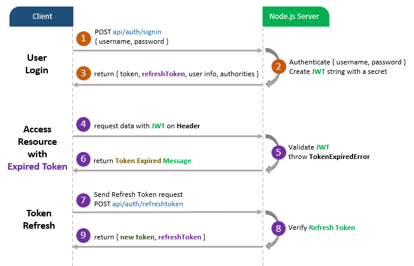

# Node.js JWT Refresh Token with MySQL example
JWT Refresh Token Implementation with Node.js Express and MySQL. You can know how to expire the JWT, then renew the Access Token with Refresh Token.

## User Registration, User Login and Authorization process.

The diagram shows flow of how we implement User Registration, User Login and Authorization process.


And this is for Refresh Token:



## Project setup
```
npm install
```

### Run
```
node server.js
```
